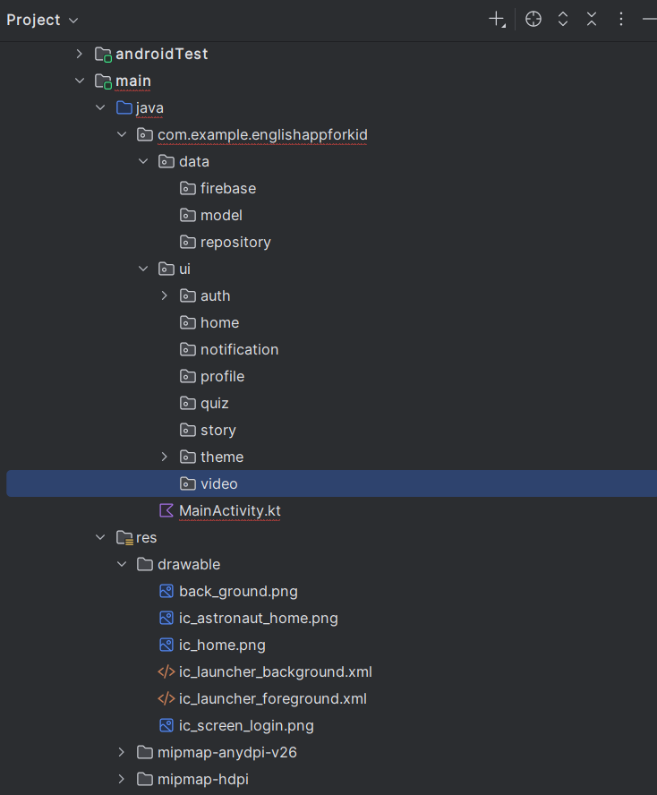

## Related Tickets
- [#Task 90500: Initialize Project](https://edu-redmine.sun-asterisk.vn/issues/90500)
## WHAT
- Setup MVVM Structure
- init Firebase

## Evidence (Screenshot or Video)

## Review Checklist

Category | View Point | Description | Expected Reviewer Answer | Self review | Reviewer2 (name)
--- | --- | --- | --- | --- | ---
Conventions | Does the code follow Sun* coding style and coding conventions? | https://github.com/framgia/coding-standards/blob/master/eng/android/coding_convention_android_kotlin.md | YES |<li>- [ ] yes</li>|<li>- [ ] yes</li>
Redmine | Does the ticket follow Sun* Redmine working process?  | https://github.com/framgia/Training-Guideline/blob/master/WorkingProcess/redmine/redmine.md| YES |<li>- [ ] yes</li>|<li>- [ ] yes</li>
Documentation | Is there any incomplete code? If so, should it be removed or flagged with a suitable marker like ‘TODO’? |  | YES |<li>- [ ] yes</li>|<li>- [ ] yes</li>
## Notes (Optional)
*(Impacted Areas in Application(List features, api, models or services that this PR will affect))*

*(Other notes)*
